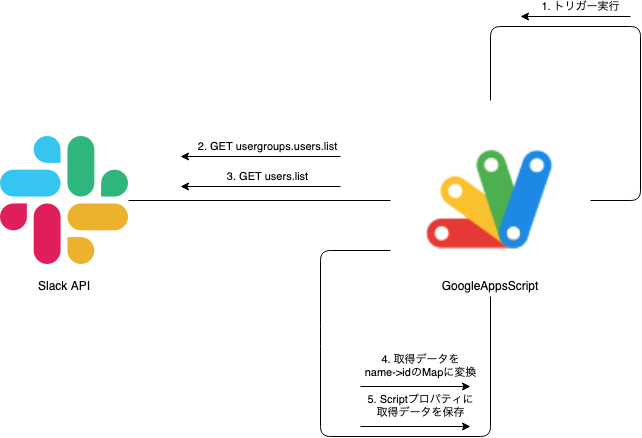
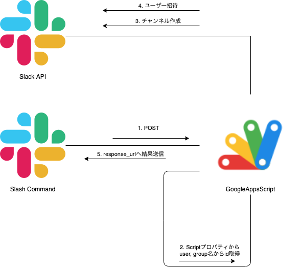

# slack-command-create-channel

## 概要

SlackのSlash Command用バックエンドAPIとして動作する
- 新チャネル作成
- ユーザーorユーザーグループをまとめて招待

GAS(GoogleAppsScript)にデプロイできるように作成している
(factoryしているgasのcomponentを入れ替えれば他でも一応使えるはず)

### 動作

#### trigger



#### doPost




## Install & Deploy

1. claspをグローバルインストール 
    - ```sh
      // claspをグローバルインストール
      yarn global add clasp
      // Log inしておく
      clasp login
      ```
1. GCPプロジェクトのロギングを使う設定
    1. [GCPプロジェクト](https://console.cloud.google.com/home/dashboard)を新規作成
        - 既存のでもOK
    1. APIとサービスのOAuth同意画面を設定
    1. 公開ステータスを公開に設定
    1. プロジェクト情報にあるプロジェクト番号を控えておく
1. [AppsScript](https://script.google.com/home)の設定
    1. 新しいプロジェクトを作成
    1. 設定からGCPプロジェクトを変更で、先ほどコピーしたプロジェクト番号を設定
    1. AppsScriptの設定からスクリプトIDをコピーしておく
    1. https://script.google.com/home/usersettingsをONにする
1. AppsScriptにソースをpushする
    1. ソースをclone
        - ```sh
          git@github.com:tkfmst/slack-command-create-channel.git
          cd slack-command-create-channel
          ```
    1. npmパッケージをインストール
        - ```sh
          yarn install
          ```
    1. `.clasp.json` にAppsScriptのスクリプトIDを設定する(要確認)
        - オプションなしで`clasp push` するとGASに新規プロジェクトが作られる
    1. ソースをAppsScriptにpush
        - ```
          yarn build
          clasp push
          ```
1. Slackでbot tokenを作成
    - Appを作成し、以下のAPIで利用するOAuth scopeを許可する
        - https://api.slack.com/methods/conversations.create
        - https://api.slack.com/methods/conversations.invite
        - https://api.slack.com/methods/users.list
        - https://api.slack.com/methods/usergroups.users.list
    - bot tokenを取得しておく
1. Slackでslash commandを作り、botを許可しておく
1. Slackで作ったAppをworkspaceにinstallする
    - 管理者許可が必要
1. Slackのbot tokenをAppsSriptに設定する
    - スクリプトプロパティに`TOKEN`というキーで設定する
    - 以下のようなtoken設定用の関数を作り実行する
        - ```
          function setVal(){
              PropertiesService.getScriptProperties().setProperty('TOKEN', 'xxxxxxxxxxxxxxxxxxxxxxx');
              // 確認
              Logger.log(PropertiesService.getScriptProperties().getProperty("TOKEN"));
          }
          ```
1. 新しく作るSlackチャンネルのベースとなる名前をAppsScriptに設定する
    - スクリプトプロパティに`BASENAME`というキーで設定する
    - 以下のようなtoken設定用の関数を作り実行する
        - ```
          function setVal(){
              PropertiesService.getScriptProperties().setProperty('BASENAME', 'xxxxxxxxxxxxxxxxxxxxxxx');
              // 確認
              Logger.log(PropertiesService.getScriptProperties().getProperty("BASENAME"));
          }
          ```
1. AppsScriptでOAuth設定
    - 設定画面で`doPost`を選んで`実行`を押すと認証設定が出る
        - スクリプトはパラメタ不足のerror情報が出て失敗する
        - GCPプロジェクトロギングにもログが出ている事を確認する
1. AppsScriptでデプロイする
    - ウェブアプリで、アクセスできるユーザーは全員で設定する
    - 全員にしないとSlack側からアクセスできない
    - URLをコピーする
1. AppsScriptのトリガー設定で、`trigger` メソッドを選択して定時実行させる
1. Slackのslash commandにデプロイしたウェブアプリのURLを設定しておく
1. commandを実行して通れば完了
    - エラーの時はログを確認する

## よくあるQ&A

### Slack

- Q. slash command打ったら`dispatch_failed`と出る
    - A. commandに設定したURLが200 OKを返してない
    - A. curlなどで確認してみる。3xxでもNG
    - A. AppsScriptでデプロイを新しく作り直してみる
- Q. slash command打ったら`timeout` が返ってくる
    - A. 3000ms以上だとそうなる。slack仕様。
    - A. ロジックを工夫する。api何度も叩くようなのは非同期実行する
        - 今回はユーザーデータ、グループデータはtriggerで別に取得するようにした
        - 多分GASだと非同期にしてもrootなメソッド(これだとdoPost)は終わらないぽいので非同期できない
- Q. ユーザーグループ名がリクエストボディからうまく取得できない
    - A. グループは`<!subteam^S0AAAAA0A|@usergroup_name>`のようなテキストで入ってくるので、パースする必要がある

### GAS

- Q. clasp createで作ったAppsScriptだとGCPプロジェクトを変更できない事がある
    - A. GAS側で新規プロジェクトで作る
- Q. clasp pushでエラーになる
    - A. エラーメッセージにある説明にだいたいURL書いていてそこにアクセスすれば解決する
    - A. https://script.google.com/home/usersettingsの設定がOFFだと権限で弾かれる
- Q. doPostのログが確認できない
    - A. GCPプロジェクトと紐づけて、ロギングを見る必要がある
    - A. ロギングはテストのまま使うにはテストユーザーを登録する必要がある
- Q. GASからHTTPリクエストできない
    - A. http requestはUrlFetchAppを使う
        - scope `https://www.googleapis.com/auth/script.external_request` を許可する必要がある
    - A. webpackすれば他のnpmも使えるかもしれないが未検証
- Q. GAS実行時の権限設定でエラー表示になる
    - A. GCPプロジェクトのOAuth同意画面で公開ステータスが`本番環境`になっている必要がある
    - A. `テスト` ならテストユーザーに登録する

### GAS written with typescript

- Q. `import * as X from './xxx'` エイリアスが読めない
    - A. GASではすべてのクラスがフラットな状態で存在するので実際の名前を全部指定する必要がある
    - A. また同じ名前のexportは競合するので使えない
    - A. webpackする
- Q. eslint, tsc, babel, webpack全部通るのにアップロードするとエラーになる
    - A. ときどきある。諦めて書きかえる
        - [ts2gas](https://github.com/grant/ts2gas)をきちんと見ればわかるかも

### その他

- Q. GAS webappについて
    - A. webappとかapiはデバッグに時間がかかる
        - ローカルである程度変換してもclaspで変換されたものが動作するかはデプロイするまで分からない
    - A. 1,2ファイルで終わるシンプルなもの、spredsheetやdrive使う場合以外はサーバ立てた方が楽に思う

## TODO

- テスト書く
